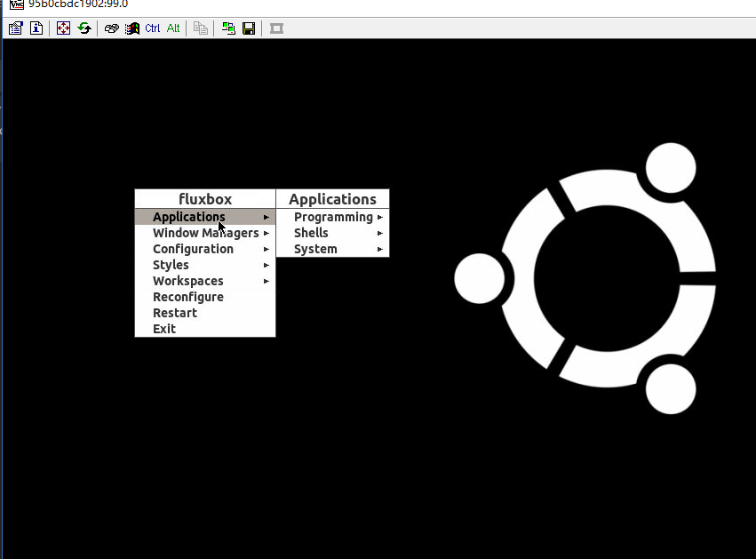
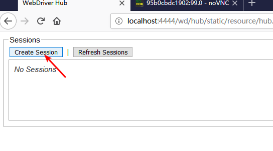
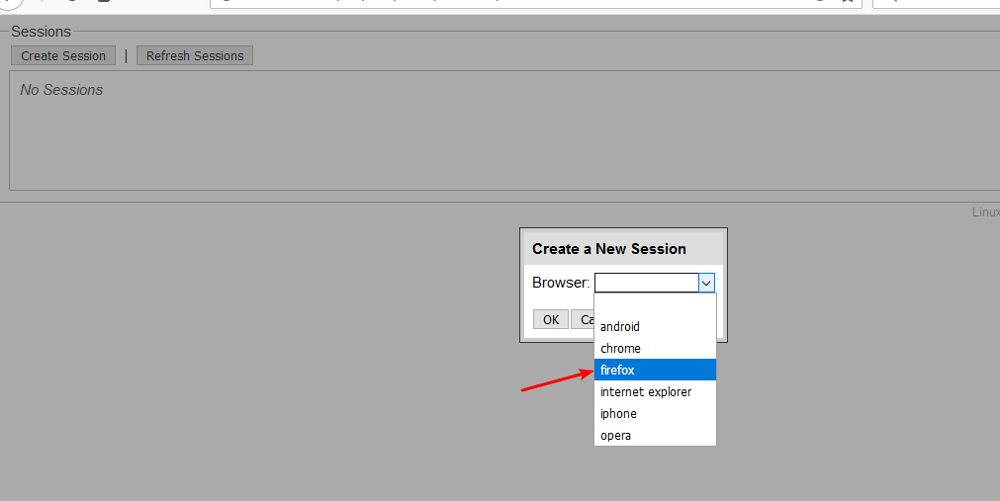
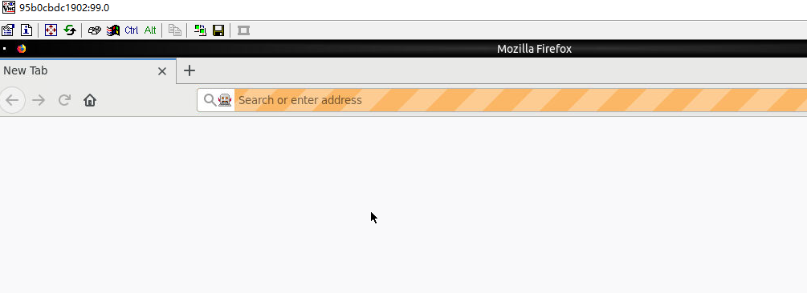
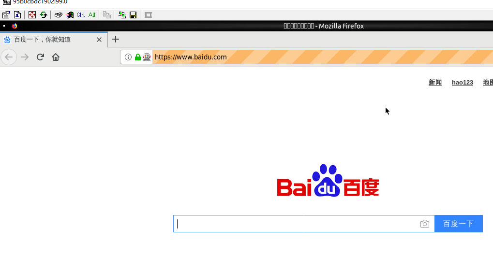

通过 selenium 调用 firefox, 一般可以有两种方式:

1. 本地调用. 通过 webdriver 直接调用本机上安装的firefox.  这种方式最简单直接. 坏处是你的代码和firefox 必须跑在同一台机器上.
2. 远程调用. 在一台机器上跑 selenium server, 然后在另一台机器上用 RemoteWebdriver 直接操作这个 selenium server. 这个 server 中可以支持 firefox, chrome 等等. 最棒的是, 这个 server 可以跑在 docker 中.

今天主要记录一下第二种方式. 

官方提供了一系列镜像: https://hub.docker.com/u/selenium/

仓库在这里: https://github.com/SeleniumHQ/docker-selenium

这些镜像基本上分为三类:

1. standalone 类,  就是我们刚才说的server
2. standalone debug 类,  跟 standalone 功能一样, 但是其中安装了 vnc server. 你可以用 vnc 直接连上去实时查看到firefox 的运行情况.
3. node 和 hub, 它们可以构建集群.


这里我们选在第二类, 就是运行起来后用vnc可以看到结果的.

先起server:
```
docker run -d -p 4444:4444 -p 5900:5900  selenium/standalone-firefox-debug:3.141.59-neon
```

这里有两个端口:  `4444` 是server 的控制端口, 可以用浏览器直接访问. `5900` 是 vnc 的端口. 可以用 `vncviewer` 直接连接. 对了 `vnc` 的默认密码是 `secert`(密码可以改, 请参考官方的说明: https://github.com/SeleniumHQ/docker-selenium). 

登陆完成可以看到 桌面了:



现在我们浏览器打开: http://localhost:4444/wd/hub/static/resource/hub.html

然后创建一个 firefox 实例吧:





再回到 vnc 的桌面就可以看到了:




前面只是开胃菜.  接下来我们看一下如何编程访问.

在本机安装好 `python` 以及 `selenium` 模块以后. 运行以下代码:

```py

from selenium import webdriver;

from selenium.webdriver.common.desired_capabilities import DesiredCapabilities


def test():
    host = "http://localhost:4444/wd/hub";
    capabilities = DesiredCapabilities.FIREFOX;
    driver = webdriver.Remote(host, capabilities)
    driver.get("http://www.baidu.com")


test()

```

你可以单步调试, 此时再看 vnc 桌面:




就到这吧, remote driver 和本地的 webdriver 接口一样. 所以用法是一样的. 其他的不罗嗦了.

到目前为止, 一切都很完美, 除了一点, 就是需要 vnc 客户端来访问桌面. 下一篇我们介绍用 novnc 来代替 vnc 客户端访问.

